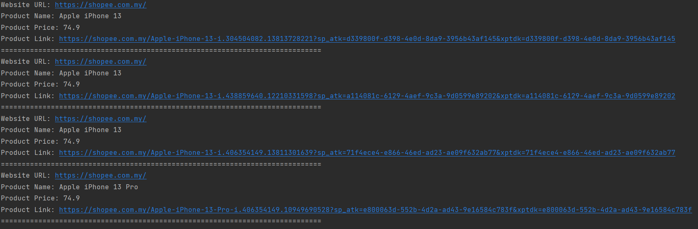

# Question 2 : Web Automation

## Project Go Through:
- `Main` Directory
    - `TestBase.java` - <b>(Contains Config File Initialization and other global variable declaration)</b>
    - `PriceComparison.java` - <b>(Contains logic operations such as visiting URLs, searching for product, getting price etc...)</b>
    - `itemDetails.java` - <b>(Item DTO to get/set items such as Website URL, Product Name, Product Price and Product URL)</b>
- `Test` Directory
    - `config.properties` - <b>(Parameterization can be done from this file like URLs and credentials)</b>
    - `PriceComparisonTest` - <b>(Test Case Initiation/Execution starts from here, where all functions called)</b>
- `pom.xml` - <b>(All dependencies mentioned inside this file)</b>

## Pre-Requisites:
- Chrome browser
- JAVA - JDK v17+ required
- All dependencies need to satisfied as pom.xml

## Execution:
- Add Run Configuration as `"PriceComparisonTest.java"`
- Run
- Example of result after the execution:
  

## Deliverables:
- After successful execution, output will be display as the followings in ascending order of price:
    - website URL
    - Product Name
    - Product Price
    - Product Link

